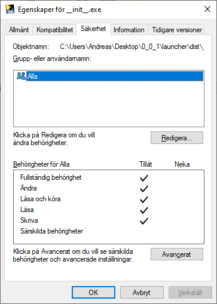
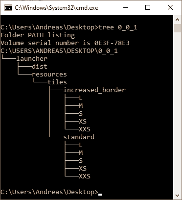
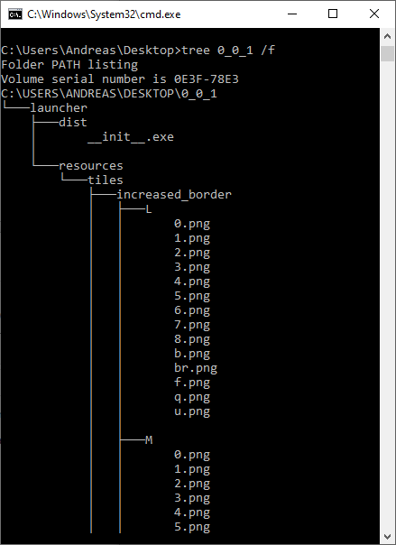

# Infinisweeper

A minesweeper clone allowing for insanely large minesweeper boards (>10 times the current Guiness World Record from 2015!). I might attempt multiplayer functionality too at a later date.

## Building a standalone .exe instructions

This project uses PyInstaller

1. Navigate to the '/launcher' folder in windows file explorer
2. Open the command prompt, by writing 'cmd' in the address bar
3. Make sure PyInstaller is installed, if you are unsure, simply run 'pip install pyinstaller' 
4. Run the command 'set PATH=%PATH%;C:\Windows\System32\downlevel;'
5. Run the command 'pyinstaller --onefile \_\_init__.py'
6. The directories 'build' and 'dist' should have appeared, as well as the file '\_\_init__.spec', move those files to the project's 'builds' directory, under a new sub-directory with the version number, for example '0_0_1'
7. Copy the 'resource' folder and place it in the directory above the '\_\_init__.exe' file
8. Test that the build works. __IMPORTANT:__ Even if it probably works to just run the file 'dist/\_\_init__.exe' now, it will only work for the current computer.
9. Right click '\_\_init__.exe' and select 'Properties' ('Egenskaper'), then 'Security' ('Säkerhet')
10. Click on 'Edit...' ('Redigera') then 'Add...' ('Lägg till'). In the big entry field write 'Everyone' ('Alla') and then 'Check Name' ('Kontrollera namn'), choose the 'Everyone' ('Alla') post, and then 'Apply' ('Verkställ'). Click 'OK' and before you exit, for the 'Everyone' field, select ('Full control')
11. __OPTIONAL(?):__ While you are at it, you should try to remove the other permissions, as they should be redundant. You need to go to the advanced settings and remove inherited permissions. When you are done with steps 9-11, the permissions should look as follows:

    
    
    **Figure 1** Permissions for \_\_init__.exe

12. Move only the relevant files from the project unto its own folder (for example on the desktop). The working build for version 0_0_1, has the structure as follows:

    
    
    **Figure 2** Permissions for \_\_init__.exe
    
    
    
    **Figure 3** Permissions for \_\_init__.exe

13. The build file should then work for any Windows machine. Distribute it via the version name folder. __TEST IT__ on another machine before you commit in git and push the new build to Github!

