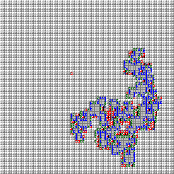
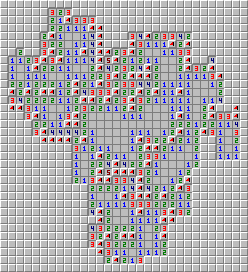
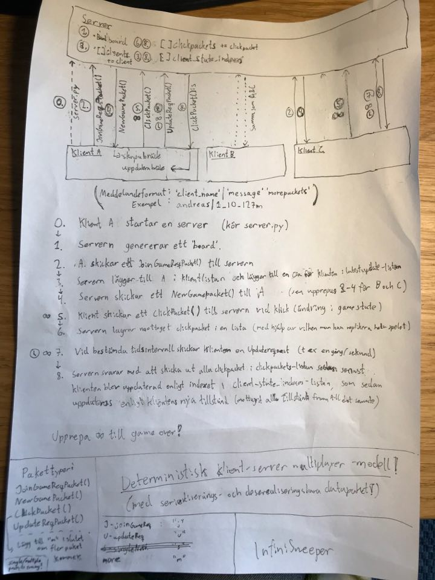

# Infinisweeper

A minesweeper clone allowing for insanely large minesweeper boards (88 times bigger than the Guinness World Record!).

## What's different about this minesweeper?

**The insanely huge boards!**
 
Typical minesweeper implementations update the entire board for every click. This is extremely inefficient computationally, and puts a maximum limit on the boards that are possible to generate while guaranteeing a responsive game without delays.

To put it simply, this version of minesweeper makes this as efficient as can be: Infinisweeper only updates those cells that need updating based on what the user clicks, and the app immediately knows which cells these are, since it calculates this when generating the board, rather than calculating this on the fly when the user clicks the cell. (This makes the board generation take longer, though! But when the game is generated, the experience is flawless.)

## I like big boards and I cannot lie

Here's a minesweeper game in progress with 4 088 by 4 088 cells, equaling 16 711 744 cells, which is the biggest board I could successfully generate on my current setup. The cell resolution is 4 by 4 pixels.  This is at expert level, 20 % bomb density, for a total of 3 342 349 bombs.

This board is **89 times larger**, or **almost two orders of magnitude larger** than the [Guiness World Records' Largest game of Minesweeper](https://www.guinnessworldrecords.com/world-records/407930-largest-game-of-minesweeper#:~:text=On%2010%20August%202015%2C%20the,mines%20to%20uncover%20and%20avoid.) in 2015.

Here's a zoom in on the top left corner:

Note that if this is too small for you, you can always use a higher cell resolution, such as 8 by 8 pixels for better readability, see an example below:

Note that higher cell resolution impacts the size of the maximum board you can generate (in my case the maximum board at this resolution is 2 045 by 2 044 = 4 179 980 cells).

Also note that you need a sufficiently large screen (or array of screens) and/or high resolution to acutally *play* these big boards properly! (Otherwise you'll need to move the window a lot!)

## How do I play?

If you're on Windows (tested on Windows 10), the easiest way to get started is to [download the latest release](https://github.com/Acoped/InfiniSweeper/releases).

Unzip the release and navigate to `InfiniSweeper_x_x_x/dist/__init__.exe` and run it.

Also, make sure that your antivirus software does not interfere. You may need to disable it. Windows may also prompt you to trust the file.

If you're on other systems, or want to contribute, you will need to set up and build the project.

## Notes on board generation, performance etc

Some specific combinations of games can't be generated (at time of writing), such as:
- Too big boards (reaching into memory limits issues I believe) 
- Big boards with too few bombs. (This is due to the optimization allowing for big boards in the first place; the reverse island search exceeds the maximum recursion depth, optimiziations to fix this are surely possible, feel free to contribute!)
- If you're having trouble generating boards that should work even when considering the above points, try restarting the app.

There are also a few bugs and possible areas of improvement (feel free to contribute!). 

However: **Once a board is launched succesfully, it should work as intended without any issues!** (in singleplayer mode). The game logic should be flaweless to my knowledge, any remaining bugs are in the launcher and on game generation.

Basic multiplayer functionality is implemented although there still are bugs for the multiplayer mode. (Again, feel free to contribute! I imagine a proper multiplayer mode could make these huge boards actually *fun* to solve together!)

Personally I was mostly curious about generating huge minesweeper boards, and since I succeeded with that, I'm probably not working much on this app going forward.

It would be fun if someone wanted to contribute to make the launcher better and perhaps finalize the multiplayer, though! 

## Additional details for curious computer science nerds

The crux normally prohibiting huge minesweeper games are the blank fields, if a blank field is clicked we need to check its neighbors to see if they too are blank, and so on until all blank fields are opened. Most implementations of minesweeper (all those that I found at least!) computes  this on the fly when the user clicks, or even just checks all cells on the entire board, which is extremely inefficient. Infinisweeper instead uses an _island search_ approach, to precalculate the addresses to all blank fields. So let's take a square board n by n cells. A normal minesweeper has time complexity O(n^2) to compute the new game state when the user clicks a blank cell whereas Infinisweeper does it at O(1) when the user clicks a cell regardless of cell content.

## Support me

The best way to support me is to listen to my music: [Acoped](https://www.acoped.com).

## Building a standalone .exe instructions (for release)

This project uses PyInstaller

1. Navigate to the '/launcher' folder in windows file explorer
2. Open the command prompt, by writing 'cmd' in the address bar
3. Make sure PyInstaller is installed, if you are unsure, simply run 'pip install pyinstaller' 
4. Run the command 'set PATH=%PATH%;C:\Windows\System32\downlevel;'
5. Run the command 'pyinstaller --onefile \_\_init__.py'
6. The directories 'build' and 'dist' should have appeared, as well as the file '\_\_init__.spec', move those files to the project's 'builds' directory, under a new sub-directory with the version number, for example '0_0_1'
7. Copy the 'resource' folder and place it in the directory above the '\_\_init__.exe' file
8. Test that the build works. __IMPORTANT:__ Even if it probably works to just run the file 'dist/\_\_init__.exe' now, it will only work for the current computer.
9. Right click '\_\_init__.exe' and select 'Properties' ('Egenskaper'), then 'Security' ('Säkerhet')
10. Click on 'Edit...' ('Redigera') then 'Add...' ('Lägg till'). In the big entry field write 'Everyone' ('Alla') and then 'Check Name' ('Kontrollera namn'), choose the 'Everyone' ('Alla') post, and then 'Apply' ('Verkställ'). Click 'OK' and before you exit, for the 'Everyone' field, select ('Full control')
11. __OPTIONAL(?):__ While you are at it, you should try to remove the other permissions, as they should be redundant. You need to go to the advanced settings and remove inherited permissions. When you are done with steps 9-11, the permissions should look as follows:

    
    
    **Figure 1** Permissions for \_\_init__.exe
12. Move only the relevant files from the project unto its own folder (for example on the desktop). The working build for version 0_0_1, has the structure as follows:

    
    
    **Figure 2** Permissions for \_\_init__.exe (directories only)
    
    
    
    **Figure 3** Permissions for \_\_init__.exe  (more detailed)

13. Rename the '\_\_init__.exe' file to 'InfiniSweeper.exe' for good looks
14. The build file should then work for any Windows machine. __TEST IT__ on another machine before you commit in git and push the new build to Github!
15. Upload the compressed .zip directory to Github and make a new release, with the appropriate naming conventions, release notes and instructions. 

## Network Model

**Figure 3** The design drawing for the Network Model of InfiniSweeper. The implementation was 95 % like this I would say